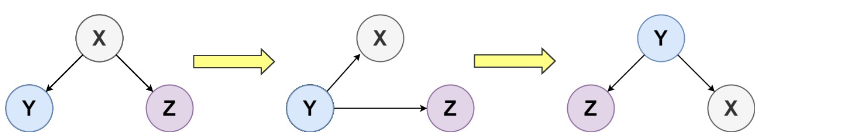
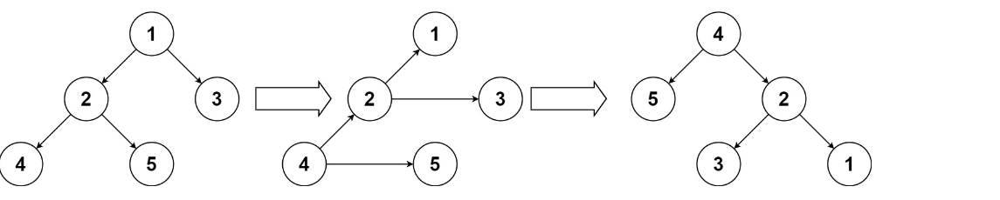

# 上下翻转二叉树

给你一个二叉树的根节点 `root` ，请你将此二叉树上下翻转，并返回新的根节点。

你可以按下面的步骤翻转一棵二叉树：

1. 原来的左子节点变成新的根节点
2. 原来的根节点变成新的右子节点
3. 原来的右子节点变成新的左子节点



上面的步骤逐层进行。题目数据保证每个右节点都有一个同级节点（即共享同一父节点的左节点）且不存在子节点。

## 示例 1：



```
输入：root = [1,2,3,4,5]
输出：[4,5,2,null,null,3,1]
```

## 示例 2：

```
输入：root = []
输出：[]
```

## 示例 3：

```
输入：root = [1]
输出：[1]
```

# 提示：

- 树中节点数目在范围 [0, 10] 内
- 1 <= Node.val <= 10
- 树中的每个右节点都有一个同级节点（即共享同一父节点的左节点）
- 树中的每个右节点都没有子节点

# 总结

1. **解决方案的基本原理是什么？**

   LeetCode问题#156《上下翻转二叉树》要求通过使其最左侧的叶子成为新的根来上下翻转一棵二叉树。此解决方案采用了递归的深度优先策略。基本情况是检查当前节点或其左子节点是否为空，如果是，则返回当前节点，因为我们已经到达了最左侧的叶子或树为空。对于每个节点，函数递归到最左侧的叶子（成为新的根），然后重新分配指针以反转以当前节点为根的子树。具体来说，原始左子节点的右指针设置为当前节点，其左指针设置为当前节点的右子节点。然后将当前节点的左右子节点置为空。

2. **在实现这个问题的代码过程中，可能会遇到哪些具体的挑战？**

   - 理解转换：主要的挑战是概念性的 —— 理解在翻转过程中如何重新分配指针。必须掌握的关键点是，新树的根是原始树的最左叶子，然后每个节点的左子节点变成其父节点，其右子节点变成其兄弟节点。
   - 处理递归：管理递归调用栈并理解执行顺序可能具有挑战性，特别是确保递归调用后正确地重新分配指针。
   - 边缘情况：处理树为空或节点没有左子节点的情况，确保算法能够优雅地处理这些情况。

3. **边界情况是如何处理的？**

   递归的基本情况处理了边界情况。如果`root`为空（即树为空）或`root->left`为空（即我们已经到达了最左侧的叶子），函数返回`root`。这种方法有效地处理了空树或单节点树等边缘情况。

4. **当思考这种编码方法时，有哪些深入的见解或启示导致了这种解决方案的产生？**

   - 递归深度优先转换：深入理解深度优先方法可以通过一次处理一个子树来简化指针重新分配是至关重要的。一旦我们到达最左侧的叶子，我们就有效地到达了我们上下颠倒的树的“底部”，从而允许我们从那里构建解决方案。
   - 原地指针重新分配：意识到我们不需要额外的数据结构来解决这个问题是重要的。我们可以就地重新分配指针，这在内存上是高效的。
   - 自下而上的递归：虽然递归是自上而下的，但指针的实际重新分配是自下而上的。这个洞察是理解解决方案如何在递归解开时构建新树的关键。

5. **对于这个解决方案，它的时间和空间复杂度是什么？请简要解释。**

   - 时间复杂度：算法的时间复杂度是O(n)，其中n是二叉树中的节点数量。这是因为算法以深度优先的方式访问每个节点一次。
   - 空间复杂度：空间复杂度是O(h)，其中h是树的高度。这个空间被递归调用栈占用。在最坏的情况下（完全不平衡的树），递归调用栈可能与n（节点数）一样大，但对于平衡树，它将是log(n)。

这个解决方案因其递归性质而优雅，它在调用栈中隐式处理问题的复杂性，而不是通过显式的复杂指针操作。理解问题约束（特别是本问题中二叉树的结构）和递归函数的属性是产生这种解决方案的关键洞见。